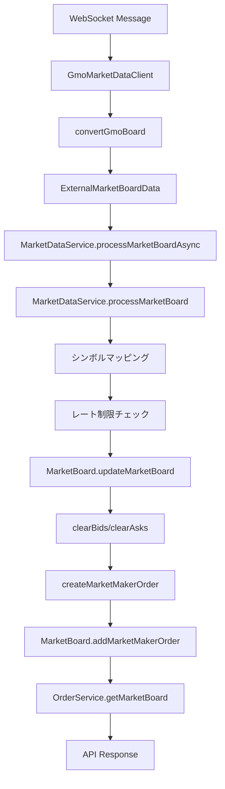
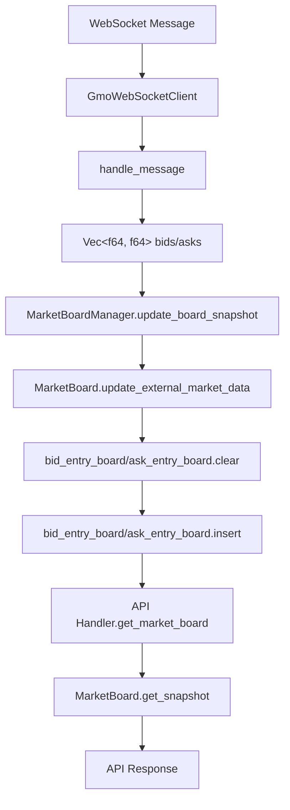

# マーケットデータ処理の詳細説明

## 概要

このドキュメントでは、Java版とRust版のマーケットデータ処理の実装を詳細に説明します。

---

## Java版のマーケットデータ処理

### アーキテクチャ

```
WebSocket Client (GMO/Bitflyer)
    ↓
MarketDataService (非同期処理)
    ↓
MarketBoard (注文板管理)
    ↓
OrderService (APIレスポンス生成)
```

### 1. WebSocketクライアント層

#### GMO WebSocketクライアント (`GmoMarketDataClient.java`)

**接続と購読:**
- WebSocket URL: `wss://api.coin.z.com/ws/public/v1`
- 購読シンボル:
  - `BTC_JPY` → `orderbooks` チャンネル
  - `BTC` → `orderbooks` チャンネル
- 購読タイミング: 接続後、2秒間隔で順次購読

**メッセージ処理:**
```java
private void handleOrderbookMessage(JsonNode message) {
    String symbol = message.get("symbol").asText();
    JsonNode bidsArray = message.get("bids");
    JsonNode asksArray = message.get("asks");
    
    // bids/asksをPriceLevelリストに変換
    ExternalMarketBoardData boardData = convertGmoBoard(symbol, bidsArray, asksArray);
    
    // 非同期処理でMarketDataServiceに渡す
    marketDataService.processMarketBoardAsync(boardData);
}
```

**データ変換:**
- `bids`: `[{"price": "13848120", "size": "0.01"}, ...]` → `List<PriceLevel>`
- `asks`: `[{"price": "13778055", "size": "0.042"}, ...]` → `List<PriceLevel>`
- シンボルマッピング:
  - `BTC_JPY` → `G_FX_BTCJPY`
  - `BTC` → `G_BTCJPY`

#### Bitflyer WebSocketクライアント (`BitflyerMarketDataClient.java`)

**接続と購読:**
- WebSocket URL: `wss://ws.lightstream.bitflyer.com/json-rpc`
- 購読チャンネル:
  - `lightning_board_snapshot_BTC_JPY` (スナップショット)
  - `lightning_board_snapshot_FX_BTC_JPY` (スナップショット)
  - `lightning_board_BTC_JPY` (デルタ更新)
  - `lightning_board_FX_BTC_JPY` (デルタ更新)

**メッセージ処理:**
```java
private void handleBoardSnapshotMessage(String method, JsonNode params) {
    String symbol = extractSymbolFromMethod(method, CHANNEL_BOARD_SNAPSHOT_PREFIX);
    JsonNode message = params.get("message");
    
    // スナップショットを変換
    ExternalMarketBoardData boardData = convertBitflyerBoard(symbol, message);
    latestBoards.put(symbol, boardData); // キャッシュに保存
    
    marketDataService.processMarketBoardAsync(boardData);
}

private void handleBoardDeltaMessage(String method, JsonNode params) {
    String symbol = extractSymbolFromMethod(method, CHANNEL_BOARD_DELTA_PREFIX);
    JsonNode message = params.get("message");
    
    // 既存のボードデータを取得
    ExternalMarketBoardData currentBoard = latestBoards.get(symbol);
    
    // デルタを適用
    ExternalMarketBoardData updatedBoard = applyBoardDelta(currentBoard, symbol, message);
    latestBoards.put(symbol, updatedBoard);
    
    marketDataService.processMarketBoardAsync(updatedBoard);
}
```

**デルタ適用ロジック:**
- `TreeMap<Double, Double>`を使用してソート済み状態を維持
- Bids: 降順（高い価格が最初）
- Asks: 昇順（低い価格が最初）
- `size == 0`の場合は価格レベルを削除、それ以外は更新/追加

### 2. MarketDataService層 (`MarketDataService.java`)

**処理フロー:**

```java
@Async("marketDataTaskExecutor")
public CompletableFuture<Void> processMarketBoardAsync(ExternalMarketBoardData data) {
    return CompletableFuture.runAsync(() -> processMarketBoard(data));
}

public void processMarketBoard(ExternalMarketBoardData data) {
    // Step 1: シンボルマッピング
    String targetSymbol = mapSymbol(data.exchange(), data.symbol());
    
    // Step 2: レート制限チェック（updateIntervalMs間隔）
    Instant now = Instant.now();
    Instant lastUpdate = lastBoardUpdateTime.get(targetSymbol);
    if (lastUpdate != null) {
        long elapsedMs = Duration.between(lastUpdate, now).toMillis();
        if (elapsedMs < updateIntervalMs) {
            return; // スキップ
        }
    }
    
    // Step 3: シンボルバリデーション
    if (!instrumentConfig.isValidSymbol(targetSymbol)) {
        return;
    }
    
    // Step 4: 更新時刻を記録
    lastBoardUpdateTime.put(targetSymbol, now);
    
    // Step 5: MarketBoardを更新（シンボル別ロック）
    updateMarketBoard(targetData);
}
```

**MarketBoard更新処理:**

```java
private void updateMarketBoard(ExternalMarketBoardData data) {
    String symbolName = data.symbol();
    Object lock = symbolLocks.computeIfAbsent(symbolName, k -> new Object());
    
    synchronized (lock) {
        MarketBoard marketBoard = getOrCreateMarketBoard(symbolName);
        
        // 既存のマーケットメーカー注文をクリア
        marketBoard.clearBids();  // MARKET_MAKER注文のみ削除
        marketBoard.clearAsks();  // ユーザー注文は保持
        
        // 新しいマーケットメーカー注文を作成・追加
        for (int i = 0; i < data.bids().size() && i < 10; i++) {
            var bidLevel = data.bids().get(i);
            double normalizedQuantity = instrumentDef.normalizeQuantity(bidLevel.quantity());
            
            long price = (long) (bidLevel.price() * instrumentDef.getPriceMultiplier());
            long quantity = (long) (normalizedQuantity * instrumentDef.getQtyMultiplier());
            
            // マーケットメーカー注文を作成
            Order marketMakerOrder = createMarketMakerOrder(symbol, price, quantity, Side.BUY);
            
            // 注文を追加（マッチング処理も実行される）
            List<Execution> executions = marketBoard.addMarketMakerOrder(marketMakerOrder);
            
            // 約定を処理
            orderService.processExecutionsForQueue(executions);
        }
        
        // asksも同様に処理
    }
}
```

**重要なポイント:**
1. **マーケットメーカー注文の作成**: 外部マーケットデータから`Order`オブジェクトを作成
2. **注文のマージ**: `addMarketMakerOrder()`で内部注文とマージ（マッチングも実行）
3. **ユーザー注文の保持**: `clearBids()/clearAsks()`は`MARKET_MAKER`ユーザーの注文のみ削除
4. **約定処理**: マーケットメーカー注文とユーザー注文がマッチした場合、約定を生成

### 3. MarketBoard層 (`MarketBoard.java`)

**データ構造:**
```java
// 注文を保持（価格 → 注文リスト）
Map<Long, LinkedList<Order>> bidOrderBoard;  // 降順（高い価格が最初）
Map<Long, LinkedList<Order>> askOrderBoard;  // 昇順（低い価格が最初）

// 数量集計（価格 → 合計数量）
Map<Long, Long> bidEntryBoard;  // 降順
Map<Long, Long> askEntryBoard;  // 昇順

// 注文ルックアップ
Map<ClOrdID, Order> orderMap;

// 最後の注文時刻
volatile long lastOrderTime;  // ナノ秒
```

**clearBids()/clearAsks()の実装:**
```java
public synchronized void clearBids() {
    // MARKET_MAKER注文のみ削除
    for (Map.Entry<Long, LinkedList<Order>> entry : bidOrderBoard.entrySet()) {
        LinkedList<Order> orders = entry.getValue();
        orders.removeIf(order -> order.getUsername().equals("MARKET_MAKER"));
    }
    
    // 空の価格レベルを削除
    bidOrderBoard.entrySet().removeIf(entry -> entry.getValue().isEmpty());
    
    // bidEntryBoardを再構築（ユーザー注文のみ）
    bidEntryBoard.clear();
    for (Map.Entry<Long, LinkedList<Order>> entry : bidOrderBoard.entrySet()) {
        Long price = entry.getKey();
        LinkedList<Order> orders = entry.getValue();
        long totalQty = 0;
        for (Order order : orders) {
            totalQty += order.getLeavesQty().getLongQty();
        }
        if (totalQty > 0) {
            bidEntryBoard.put(price, totalQty);
        }
    }
}
```

**getMarketBoard()の実装:**
```java
public MarketBoardResponse getMarketBoard(String symbolName, int depth) {
    MarketBoard marketBoard = marketBoards.get(symbolName.toUpperCase());
    
    // ビッド（買い注文）を取得（降順、高い価格が最初）
    for (int i = 0; i < depth; i++) {
        Pair<Long, Long> bid = marketBoard.getBid(i);
        if (bid.getLeft() != 0L && bid.getRight() != 0L) {
            double price = (double) bid.getLeft() / instrument.getPriceMultiplier();
            double quantity = (double) bid.getRight() / instrument.getQtyMultiplier();
            bids.add(new MarketBoardResponse.PriceLevel(price, quantity));
        } else {
            break;
        }
    }
    
    // アスク（売り注文）を取得（昇順、低い価格が最初）
    for (int i = 0; i < depth; i++) {
        Pair<Long, Long> ask = marketBoard.getAsk(i);
        if (ask.getLeft() != 0L && ask.getRight() != 0L) {
            double price = (double) ask.getLeft() / instrument.getPriceMultiplier();
            double quantity = (double) ask.getRight() / instrument.getQtyMultiplier();
            asks.add(new MarketBoardResponse.PriceLevel(price, quantity));
        } else {
            break;
        }
    }
    
    // asOfタイムスタンプを取得
    long asOf = marketBoard.getLastOrderTime();
    
    return new MarketBoardResponse(symbolName, bids, asks, asOf);
}
```

---

## Rust版のマーケットデータ処理

### アーキテクチャ

```
WebSocket Client (GMO/Bitflyer)
    ↓
MarketBoardManager (非同期処理)
    ↓
MarketBoard (注文板管理)
    ↓
API Handler (レスポンス生成)
```

### 1. WebSocketクライアント層

#### GMO WebSocketクライアント (`websocket/gmo.rs`)

**接続と購読:**
- WebSocket URL: `wss://api.coin.z.com/ws/public/v1`
- 購読シンボル:
  - `("BTC_JPY", "orderbooks")`
  - `("BTC", "orderbooks")`
- 購読タイミング: 接続後、500ms間隔で順次購読

**メッセージ処理:**
```rust
async fn handle_message(text: &str, board_manager: &MarketBoardManager, config: &Config) -> Result<()> {
    if let Ok(orderbook_msg) = serde_json::from_str::<OrderbookMessage>(text) {
        if orderbook_msg.channel == "orderbooks" {
            let symbol = &orderbook_msg.symbol;
            let target_symbol = Self::map_symbol(symbol, config)?;
            
            // bids/asksをVec<(f64, f64)>に変換
            let bids: Vec<(f64, f64)> = orderbook_msg.bids
                .iter()
                .filter(|b| b.size.parse::<f64>().unwrap_or(0.0) > 0.0)
                .map(|b| (b.price.parse::<f64>()?, b.size.parse::<f64>()?))
                .collect();
            
            let asks: Vec<(f64, f64)> = orderbook_msg.asks
                .iter()
                .filter(|a| a.size.parse::<f64>().unwrap_or(0.0) > 0.0)
                .map(|a| (a.price.parse::<f64>()?, a.size.parse::<f64>()?))
                .collect();
            
            // MarketBoardManagerに渡す
            board_manager.update_board_snapshot(target_symbol.clone(), bids, asks).await;
        }
    }
    Ok(())
}
```

**シンボルマッピング:**
```rust
fn map_symbol(symbol: &str, config: &Config) -> Result<String> {
    match symbol {
        "BTC_JPY" => Ok("G_FX_BTCJPY".to_string()),
        "BTC" => Ok("G_BTCJPY".to_string()),
        _ => Err(anyhow::anyhow!("Unknown GMO symbol for mapping: {}", symbol)),
    }
}
```

#### Bitflyer WebSocketクライアント (`websocket/bitflyer.rs`)

**接続と購読:**
- WebSocket URL: `wss://ws.lightstream.bitflyer.com/json-rpc`
- 購読チャンネル:
  - `lightning_board_snapshot_BTC_JPY`
  - `lightning_board_snapshot_FX_BTC_JPY`
  - `lightning_board_BTC_JPY` (デルタ)
  - `lightning_board_FX_BTC_JPY` (デルタ)

**メッセージ処理:**
```rust
async fn handle_message(text: &str, board_manager: &MarketBoardManager, config: &Config) -> Result<()> {
    if let Ok(board_msg) = serde_json::from_str::<BoardMessage>(text) {
        let channel = &board_msg.params.channel;
        let symbol = Self::extract_symbol_from_channel(channel)?;
        let target_symbol = Self::map_symbol(&symbol, config)?;
        
        let bids: Vec<(f64, f64)> = board_msg.params.message.bids
            .iter()
            .filter(|b| b.size > 0.0)
            .map(|b| (b.price, b.size))
            .collect();
        
        let asks: Vec<(f64, f64)> = board_msg.params.message.asks
            .iter()
            .filter(|a| a.size > 0.0)
            .map(|a| (a.price, a.size))
            .collect();
        
        if channel.contains("snapshot") {
            board_manager.update_board_snapshot(target_symbol, bids, asks).await;
        } else {
            board_manager.update_board_delta(target_symbol, bids, asks).await;
        }
    }
    Ok(())
}
```

### 2. MarketBoardManager層 (`market_board/manager.rs`)

**処理フロー:**

```rust
pub async fn update_board_snapshot(
    &self,
    symbol: String,
    bids: Vec<(f64, f64)>,
    asks: Vec<(f64, f64)>,
) {
    let board = self.get_or_create_board(symbol.clone()).await;
    
    {
        let mut board_guard = board.write().await;
        // 外部マーケットデータを更新（既存データをクリアしてから更新）
        board_guard.update_external_market_data(bids, asks);
    }
}
```

**重要なポイント:**
- **非同期処理**: `async/await`を使用
- **ロック制御**: `RwLock`で読み書きを制御
- **シンボル別ボード**: `DashMap`でシンボルごとにボードを管理

### 3. MarketBoard層 (`market_board/board.rs`)

**データ構造:**
```rust
pub struct MarketBoard {
    symbol: String,
    // 注文を保持（価格 → 注文リスト）
    bid_order_board: BTreeMap<i64, Vec<OrderEntry>>,  // 昇順（rev()で降順に）
    ask_order_board: BTreeMap<i64, Vec<OrderEntry>>,  // 昇順
    
    // 数量集計（価格 → 合計数量）
    bid_entry_board: BTreeMap<i64, i64>,  // 昇順（rev()で降順に）
    ask_entry_board: BTreeMap<i64, i64>,  // 昇順
    
    // 注文ルックアップ
    order_map: HashMap<String, OrderEntry>,
    
    // 最後の注文時刻
    last_order_time: AtomicU64,  // ナノ秒
}
```

**update_external_market_data()の実装:**
```rust
pub fn update_external_market_data(&mut self, bids: Vec<(f64, f64)>, asks: Vec<(f64, f64)>) {
    const DEFAULT_PRICE_MULTIPLIER: f64 = 1_000_000.0;
    const DEFAULT_QTY_MULTIPLIER: f64 = 1_000_000.0;
    
    // 既存の外部マーケットデータをクリア
    self.bid_entry_board.clear();
    self.ask_entry_board.clear();
    
    // bidsを更新（BTreeMapは自動的に昇順でソート）
    for (price, qty) in bids {
        let raw_price = (price * DEFAULT_PRICE_MULTIPLIER) as i64;
        let raw_qty = (qty * DEFAULT_QTY_MULTIPLIER) as i64;
        if raw_qty > 0 {
            self.bid_entry_board.insert(raw_price, raw_qty);
        }
    }
    
    // asksを更新
    for (price, qty) in asks {
        let raw_price = (price * DEFAULT_PRICE_MULTIPLIER) as i64;
        let raw_qty = (qty * DEFAULT_QTY_MULTIPLIER) as i64;
        if raw_qty > 0 {
            self.ask_entry_board.insert(raw_price, raw_qty);
        }
    }
    
    // 最後の注文時刻を更新
    self.last_order_time.store(
        SystemTime::now().duration_since(UNIX_EPOCH).unwrap().as_nanos() as u64,
        Ordering::Relaxed,
    );
}
```

**get_snapshot()の実装:**
```rust
pub fn get_snapshot(&self, max_levels: usize) -> (Vec<PriceLevel>, Vec<PriceLevel>) {
    // bids: 降順（高い価格が最初）- rev()で逆順に
    let bids: Vec<PriceLevel> = self.bid_entry_board
        .iter()
        .rev()  // 昇順を降順に変換
        .take(max_levels)
        .map(|(price, qty)| PriceLevel {
            price: *price as f64,
            quantity: *qty as f64,
        })
        .collect();
    
    // asks: 昇順（低い価格が最初）
    let asks: Vec<PriceLevel> = self.ask_entry_board
        .iter()
        .take(max_levels)
        .map(|(price, qty)| PriceLevel {
            price: *price as f64,
            quantity: *qty as f64,
        })
        .collect();
    
    (bids, asks)
}
```

### 4. APIハンドラー層 (`api/market_board.rs`)

**get_market_board()の実装:**
```rust
pub async fn get_market_board(
    Extension(state): Extension<AppState>,
    Path(symbol): Path<String>,
    Query(params): Query<MarketBoardQuery>,
) -> Result<Json<MarketBoardResponse>, (StatusCode, Json<ErrorResponse>)> {
    let board = state.market_board_manager.get_or_create_board(symbol.clone()).await;
    let instrument = state.config.get_instrument(&symbol)?;
    
    let price_multiplier = instrument.price_multiplier as f64;
    let qty_multiplier = instrument.qty_multiplier as f64;
    
    let (bids, asks, as_of) = {
        let board_guard = board.read().await;
        let (raw_bids, raw_asks) = board_guard.get_snapshot(params.depth as usize);
        let as_of = board_guard.get_last_order_time();
        
        // 生価格を実際の価格に変換
        let bids: Vec<PriceLevel> = raw_bids
            .into_iter()
            .map(|p| PriceLevel {
                price: p.price / price_multiplier,
                quantity: p.quantity / qty_multiplier,
            })
            .collect();
        
        let asks: Vec<PriceLevel> = raw_asks
            .into_iter()
            .map(|p| PriceLevel {
                price: p.price / price_multiplier,
                quantity: p.quantity / qty_multiplier,
            })
            .collect();
        
        (bids, asks, as_of)
    };
    
    Ok(Json(MarketBoardResponse {
        symbol,
        bids,
        asks,
        as_of,
    }))
}
```

---

## 主な違いと問題点

### 1. データ更新方式の違い

**Java版:**
- マーケットメーカー注文を作成して`addMarketMakerOrder()`で追加
- 内部注文（ユーザー注文）とマージされる
- `clearBids()/clearAsks()`でマーケットメーカー注文のみ削除

**Rust版:**
- `update_external_market_data()`で`bid_entry_board`と`ask_entry_board`を直接更新
- 内部注文とは分離されていない（現在は全体をクリア）
- 注文オブジェクトは作成されない

### 2. スプレッドがマイナスになる問題

**原因:**
- APIレスポンスで`bids[0].price = 13848120.0`、`asks[0].price = 13778055.0`
- `bids[0].price > asks[0].price`となっている（異常）
- 通常、`bids[0].price < asks[0].price`になるべき

**可能性:**
1. WebSocketから来ているデータでbidsとasksが逆になっている
2. `update_external_market_data()`でbidsとasksが逆に処理されている
3. `get_snapshot()`の順序が間違っている

**修正済み:**
- `update_external_market_data()`で`bid_entry_board`と`ask_entry_board`をクリアするように修正
- デバッグログを追加してbidsとasksの順序を確認

### 3. GMO BTC/JPY (現物) が空データになる問題

**原因:**
- `G_BTCJPY`のAPIレスポンスで`bidCount: 0, askCount: 0`
- WebSocketから`BTC`シンボルのデータが来ていない可能性

**確認事項:**
1. GMOのWebSocket購読で`("BTC", "orderbooks")`が正しく購読されているか
2. `BTC`シンボルのメッセージが来ているか
3. `map_symbol()`で`BTC`が`G_BTCJPY`に正しくマッピングされているか

**修正済み:**
- デバッグログを追加して`BTC`シンボルのデータが来ているか確認

---

## データフロー図

### Java版



### Rust版



---

## 価格と数量の変換

### Java版

```java
// 外部マーケットデータ（f64）→ 内部表現（i64）
long price = (long) (bidLevel.price() * instrumentDef.getPriceMultiplier());
long quantity = (long) (normalizedQuantity * instrumentDef.getQtyMultiplier());

// 内部表現（i64）→ APIレスポンス（f64）
double price = (double) bid.getLeft() / instrument.getPriceMultiplier();
double quantity = (double) bid.getRight() / instrument.getQtyMultiplier();
```

### Rust版

```rust
// 外部マーケットデータ（f64）→ 内部表現（i64）
let raw_price = (price * DEFAULT_PRICE_MULTIPLIER) as i64;
let raw_qty = (qty * DEFAULT_QTY_MULTIPLIER) as i64;

// 内部表現（i64）→ APIレスポンス（f64）
price: p.price / price_multiplier,
quantity: p.quantity / qty_multiplier,
```

---

## 順序の管理

### Java版

```java
// bidEntryBoard: 降順（高い価格が最初）
Map<Long, Long> bidEntryBoard = new TreeMap<>(
    new Comparator<Long>() {
        @Override
        public int compare(Long o1, Long o2) {
            return (int) (o2 - o1);  // 降順
        }
    });

// askEntryBoard: 昇順（低い価格が最初）
Map<Long, Long> askEntryBoard = new TreeMap<>();  // デフォルトで昇順
```

### Rust版

```rust
// bid_entry_board: 昇順（rev()で降順に変換）
BTreeMap<i64, i64> bid_entry_board;  // デフォルトで昇順

// get_snapshot()でrev()を使用
.iter().rev()  // 降順に変換

// ask_entry_board: 昇順
BTreeMap<i64, i64> ask_entry_board;  // デフォルトで昇順
```

---

## 問題の根本原因

### 問題1: スプレッドがマイナス

**Java版の動作:**
- `bidEntryBoard`は降順（高い価格が最初）
- `askEntryBoard`は昇順（低い価格が最初）
- `getBid(0)`は最高Bid価格を返す
- `getAsk(0)`は最低Ask価格を返す
- 通常、`getBid(0) < getAsk(0)`になるべき

**Rust版の動作:**
- `bid_entry_board`は昇順（`rev()`で降順に変換）
- `ask_entry_board`は昇順
- `get_snapshot()`で`bids`は`rev()`で降順に変換
- `asks`は昇順のまま
- しかし、実際のAPIレスポンスでは`bids[0].price > asks[0].price`となっている

**原因の仮説:**
1. WebSocketから来ているデータでbidsとasksが逆になっている
2. `update_external_market_data()`でbidsとasksが逆に処理されている
3. GMOのWebSocketメッセージの構造が想定と異なる

### 問題2: GMO BTC/JPY (現物) が空データ

**Java版:**
- `BTC`シンボルを購読
- `convertGmoBoard()`で`BTC`を`G_BTCJPY`にマッピング
- `MarketDataService`で処理

**Rust版:**
- `BTC`シンボルを購読
- `map_symbol()`で`BTC`を`G_BTCJPY`にマッピング
- しかし、データが来ていない可能性

**原因の仮説:**
1. GMOのWebSocketで`BTC`シンボルが正しく購読されていない
2. `BTC`シンボルのメッセージが来ていない
3. メッセージのパースに失敗している

---

## 推奨される修正

1. **スプレッド問題の修正:**
   - WebSocketメッセージのログを追加してbidsとasksの順序を確認
   - GMOのWebSocketメッセージ構造を確認
   - `update_external_market_data()`でbidsとasksが正しく処理されているか確認

2. **GMO現物データ問題の修正:**
   - `BTC`シンボルの購読を確認
   - `BTC`シンボルのメッセージが来ているかログで確認
   - `map_symbol()`の動作を確認

