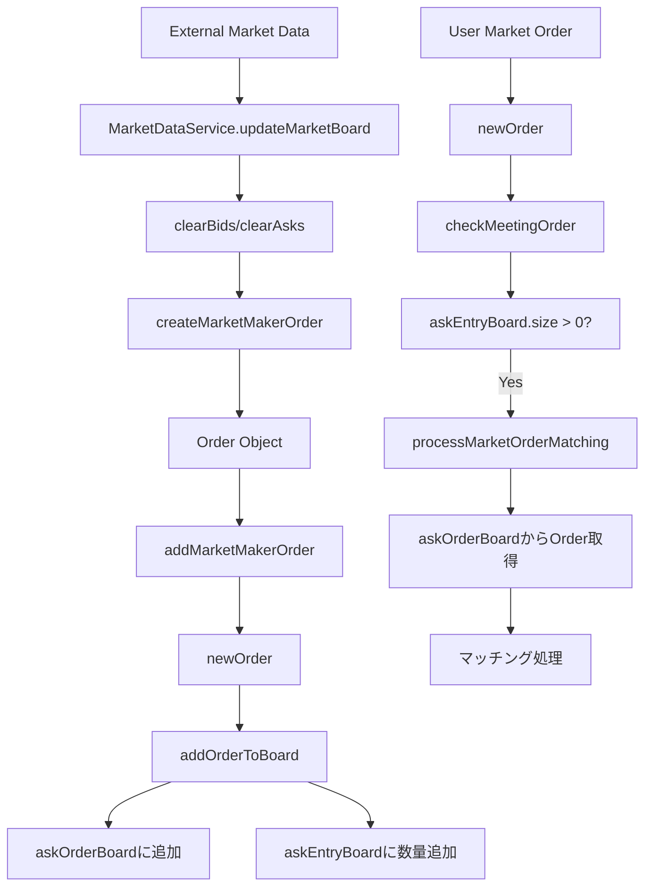
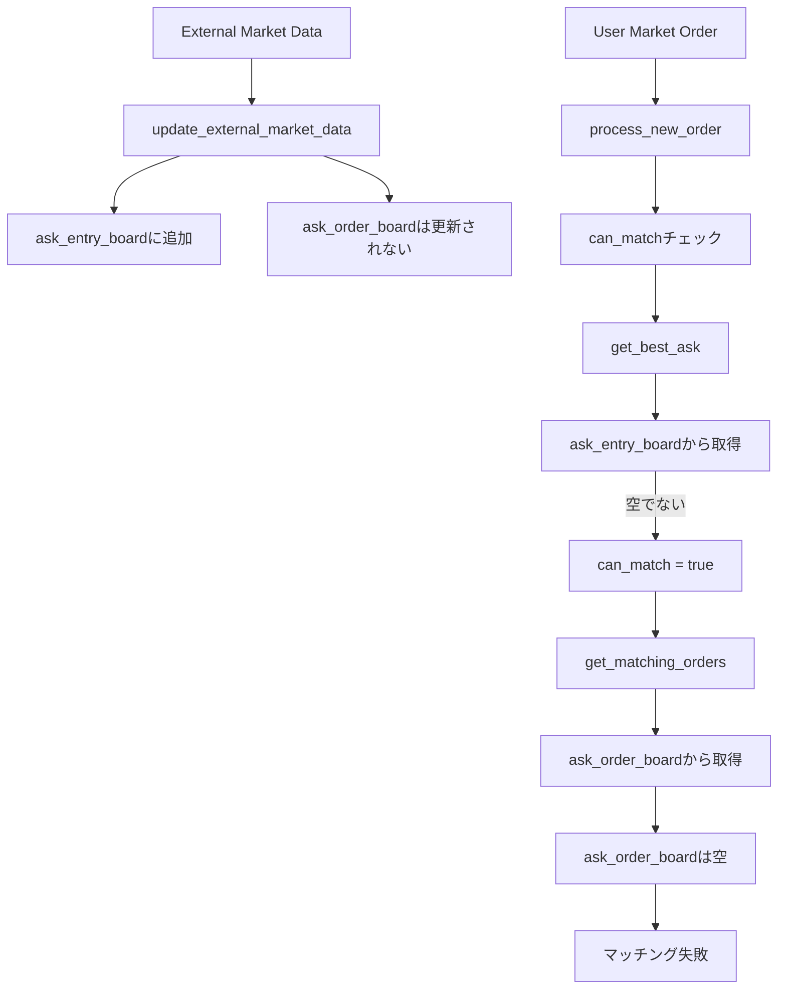
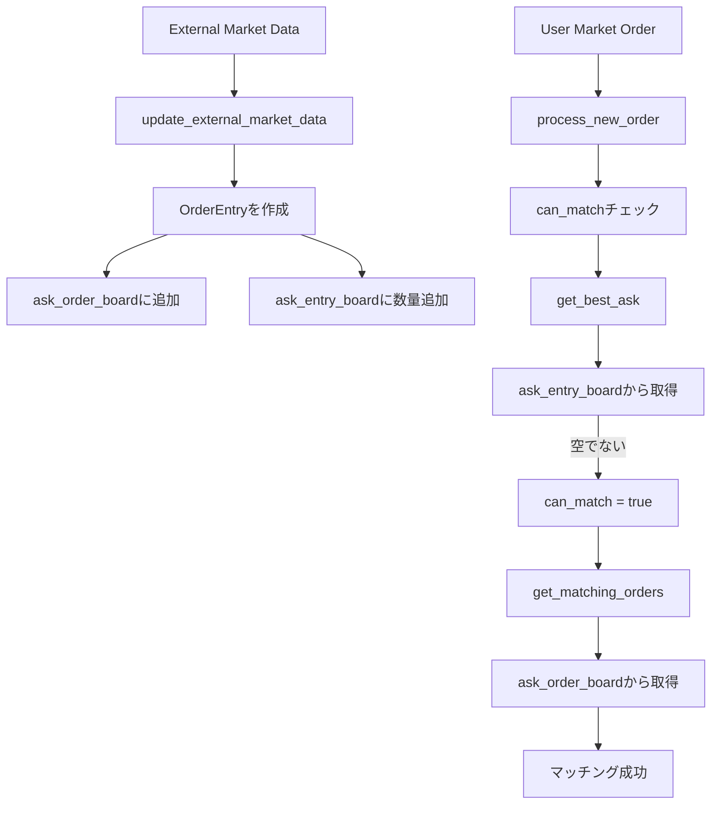

# マッチングエンジンの詳細ドキュメント

## 概要

このドキュメントでは、Java版とRust版のマッチングエンジンのロジックを詳細に説明し、両者の違いを明確化します。

---

## Java版マッチングエンジン

### データ構造

```java
// 注文を保持（価格 → 注文リスト）
Map<Long, LinkedList<Order>> askOrderBoard;  // 昇順（低い価格が最初）
Map<Long, LinkedList<Order>> bidOrderBoard;  // 降順（高い価格が最初）

// 数量集計（価格 → 合計数量）
Map<Long, Long> askEntryBoard;  // 昇順
Map<Long, Long> bidEntryBoard;  // 降順

// 注文ルックアップ
Map<ClOrdID, Order> orderMap;
```

**重要なポイント:**
- `askOrderBoard`と`bidOrderBoard`には実際の`Order`オブジェクトが保存される
- `askEntryBoard`と`bidEntryBoard`は数量の集計のみ（高速検索用）
- 外部マーケットデータも`Order`オブジェクトとして`askOrderBoard`/`bidOrderBoard`に追加される

### 注文処理フロー

#### 1. `newOrder(Order order)` メソッド

```java
public synchronized List<Execution> newOrder(Order order) {
    List<Execution> executions = new ArrayList<Execution>();
    updateLastOrderTime();
    
    // 重複チェック
    if (orderMap.get(order.getClOrdID()) != null) {
        return createReject(order);
    }
    
    // マッチング可能かチェック
    if (checkMeetingOrder(order)) {
        return processOrderMatching(order);
    } else {
        // マッチング不可の場合
        if (order.getOrdType() == OrdType.MARKET) {
            // 成行注文でマッチング不可 → 拒否
            return createReject(order);
        } else {
            // 指値注文
            if (order.getTif() == Tif.FOK) {
                // FOK注文でマッチング不可 → 拒否
                return createReject(order);
            } else {
                // GTC/IOC注文 → 板に追加
                Execution e = createNew(order);
                addOrderToBoard(order);
                return e;
            }
        }
    }
}
```

**フロー図:**
```
newOrder(order)
    ↓
重複チェック
    ↓
checkMeetingOrder(order)
    ├─ true → processOrderMatching(order)
    └─ false → 
        ├─ MARKET → createReject()
        └─ LIMIT → 
            ├─ FOK → createReject()
            └─ GTC/IOC → addOrderToBoard()
```

#### 2. `checkMeetingOrder(Order order)` メソッド

成行注文（MARKET + IOC）の処理:

```java
boolean checkMeetingOrder(Order order) {
    if (order.getSide() == Side.BUY) {
        // 買い注文の場合
        if (askEntryBoard.size() == 0) {
            return false;  // Ask板が空
        }
        
        // 成行注文（MARKET + IOC）の場合
        if (order.getTif() == Tif.IOC && order.getOrdType() == OrdType.MARKET) {
            return true;  // 常にtrue（板があればマッチング可能）
        }
        
        // 成行注文（MARKET + FOK）の場合
        if (order.getTif() == Tif.FOK && order.getOrdType() == OrdType.MARKET) {
            long qty = order.getOrderQty().getLongQty();
            long sum = 0;
            // Ask板の合計数量をチェック
            for (Entry<Long, Long> ent : askEntryBoard.entrySet()) {
                sum += ent.getValue();
                if (sum >= qty) {
                    return true;  // 十分な数量がある
                }
            }
            return false;  // 数量不足
        }
        
        // 指値注文の場合
        return checkMeetingAsk(order);
    } else {
        // 売り注文の場合（同様のロジック）
        // ...
    }
}
```

**重要なポイント:**
- 成行注文（MARKET + IOC）の場合、`askEntryBoard.size() > 0`であれば`true`を返す
- `askEntryBoard`は`askOrderBoard`から集計された数量情報
- 外部マーケットデータが`askOrderBoard`に追加されていれば、`askEntryBoard`にも反映される

#### 3. `processMarketOrderMatching(Order order)` メソッド

```java
List<Execution> processMarketOrderMatching(Order order) {
    List<Execution> elist = new ArrayList<Execution>();
    long leavesQty = order.getLeavesQty().getLongQty();
    
    // マッチング対象の板を選択
    Map<Long, LinkedList<Order>> board = 
        order.getSide() == Side.BUY ? askOrderBoard : bidOrderBoard;
    Map<Long, Long> entryBoard = 
        order.getSide() == Side.BUY ? askEntryBoard : bidEntryBoard;
    
    // 価格レベルごとに処理
    for (Entry<Long, LinkedList<Order>> ent : board.entrySet()) {
        Long px = ent.getKey();
        LinkedList<Order> orders = ent.getValue();
        List<Order> removeOrders = new ArrayList<>();
        
        // 各注文とマッチング
        for (Order counterOrder : orders) {
            long opposingQty = counterOrder.getOrderQty().getLongQty();
            
            if (leavesQty > opposingQty) {
                // 新規注文: 部分約定、相手注文: 完全約定
                Execution e1 = createExecutionAndOperateOrder(
                    order, ExecStatus.PARTIAL_FILL, px, opposingQty, false, counterOrder.getUsername());
                Execution e2 = createExecutionAndOperateOrder(
                    counterOrder, ExecStatus.FILLED, px, opposingQty, true, order.getUsername());
                elist.add(e1);
                elist.add(e2);
                leavesQty -= opposingQty;
            } else if (leavesQty == opposingQty) {
                // 両方とも完全約定
                Execution e1 = createExecutionAndOperateOrder(
                    order, ExecStatus.FILLED, px, opposingQty, false, counterOrder.getUsername());
                Execution e2 = createExecutionAndOperateOrder(
                    counterOrder, ExecStatus.FILLED, px, opposingQty, true, order.getUsername());
                elist.add(e1);
                elist.add(e2);
                leavesQty = 0;
            } else if (leavesQty < opposingQty) {
                // 新規注文: 完全約定、相手注文: 部分約定
                Execution e1 = createExecutionAndOperateOrder(
                    order, ExecStatus.FILLED, px, leavesQty, false, counterOrder.getUsername());
                Execution e2 = createExecutionAndOperateOrder(
                    counterOrder, ExecStatus.PARTIAL_FILL, px, leavesQty, true, order.getUsername());
                elist.add(e1);
                elist.add(e2);
                leavesQty = 0;
            }
            
            // 完全約定した注文を削除リストに追加
            if (counterOrder.getLeavesQty().getLongQty() == 0L) {
                removeOrders.add(counterOrder);
            }
        }
        
        // 完全約定した注文を削除
        for (Order o : removeOrders) {
            orders.remove(o);
            orderMap.remove(o.getClOrdID());
        }
        
        // 価格レベルの更新
        if (orders.isEmpty()) {
            entryBoard.remove(px);
        } else {
            // 残りの数量を再計算
            long totalQty = 0;
            for (Order remainingOrder : orders) {
                totalQty += remainingOrder.getLeavesQty().getLongQty();
            }
            entryBoard.put(px, totalQty);
        }
        
        // 完全約定したら終了
        if (leavesQty == 0) {
            break;
        }
    }
    
    return elist;
}
```

**重要なポイント:**
- `askOrderBoard`から実際の`Order`オブジェクトを取得してマッチング
- 外部マーケットデータも`Order`オブジェクトとして`askOrderBoard`に保存されている
- `askEntryBoard`は数量集計のみで、マッチングには使用されない

### 外部マーケットデータの処理

#### `addMarketMakerOrder(Order order)` メソッド

```java
public synchronized List<Execution> addMarketMakerOrder(Order order) {
    return newOrder(order);  // 通常の注文処理と同じ
}
```

**処理フロー:**
```
MarketDataService.updateMarketBoard()
    ↓
marketBoard.clearBids() / clearAsks()  // 既存のマーケットメーカー注文を削除
    ↓
createMarketMakerOrder()  // Orderオブジェクトを作成
    ↓
marketBoard.addMarketMakerOrder()  // newOrder()を呼び出し
    ↓
addOrderToBoard()  // askOrderBoard / bidOrderBoardに追加
    ↓
askEntryBoard / bidEntryBoardに数量を追加
```

**重要なポイント:**
- 外部マーケットデータは`Order`オブジェクトとして`askOrderBoard`/`bidOrderBoard`に追加される
- `askEntryBoard`/`bidEntryBoard`にも数量が反映される
- マッチング時は`askOrderBoard`から`Order`オブジェクトを取得して処理

---

## Rust版マッチングエンジン

### データ構造

```rust
// 注文を保持（価格 → 注文リスト）
bid_order_board: BTreeMap<i64, Vec<OrderEntry>>,  // 昇順（rev()で降順に）
ask_order_board: BTreeMap<i64, Vec<OrderEntry>>,  // 昇順

// 数量集計（価格 → 合計数量）
bid_entry_board: BTreeMap<i64, i64>,  // 昇順（rev()で降順に）
ask_entry_board: BTreeMap<i64, i64>,  // 昇順

// 注文ルックアップ
order_map: HashMap<String, OrderEntry>,
```

**重要なポイント:**
- `ask_order_board`と`bid_order_board`には`OrderEntry`が保存される
- `ask_entry_board`と`bid_entry_board`は数量の集計のみ
- **外部マーケットデータは`ask_entry_board`/`bid_entry_board`にのみ保存され、`ask_order_board`/`bid_order_board`には保存されない**

### 注文処理フロー

#### 1. `process_new_order()` メソッド

```rust
pub async fn process_new_order(
    &self,
    username: &str,
    request: &NewOrderRequest,
) -> Result<OrderResponse> {
    // バリデーション
    // 資金チェック
    // 注文作成
    
    let board = self.market_board_manager.get_or_create_board(symbol).await;
    let mut board_lock = board.write().await;
    
    // マッチング可能かチェック
    let can_match = match side {
        Side::Buy => {
            if let Some((best_ask_price, _)) = board_lock.get_best_ask() {
                if let Some(limit_price) = order.raw_price {
                    best_ask_price <= limit_price
                } else {
                    true  // Market order
                }
            } else {
                false  // 板が空
            }
        }
        // ...
    };
    
    if can_match {
        // マッチング処理
        let matching_orders = board_lock.get_matching_orders(
            side,
            order.raw_price,
            order.raw_leaves_qty,
        );
        // 約定処理
    } else {
        // マッチング不可
        if ord_type == OrdType::Limit {
            // 板に追加
        } else {
            // Market order → 拒否
        }
    }
}
```

**フロー図:**
```
process_new_order(request)
    ↓
バリデーション・資金チェック
    ↓
can_matchチェック（get_best_ask() / get_best_bid()）
    ├─ true → get_matching_orders()
    └─ false → 
        ├─ MARKET → createReject()
        └─ LIMIT → add_order()
```

#### 2. `can_match` チェック

```rust
let can_match = match side {
    Side::Buy => {
        if let Some((best_ask_price, _)) = board_lock.get_best_ask() {
            // ask_entry_boardから最良Ask価格を取得
            if let Some(limit_price) = order.raw_price {
                best_ask_price <= limit_price
            } else {
                true  // Market order
            }
        } else {
            false  // 板が空
        }
    }
    // ...
};
```

**重要なポイント:**
- `get_best_ask()`は`ask_entry_board`から最良価格を取得
- 成行注文の場合、`ask_entry_board`が空でなければ`true`を返す
- しかし、`get_matching_orders()`は`ask_order_board`から注文を取得する

#### 3. `get_matching_orders()` メソッド

```rust
pub fn get_matching_orders(
    &mut self,
    side: crate::models::Side,
    price: Option<i64>,
    quantity: i64,
) -> Vec<(OrderEntry, i64)> {
    let mut results = Vec::new();
    let mut remaining_qty = quantity;
    
    match side {
        Side::Buy => {
            // ask_entry_boardから価格リストを取得
            let prices: Vec<i64> = self.ask_entry_board.keys().cloned().collect();
            
            for ask_price in prices {
                // ask_order_boardから注文を取得
                if let Some(orders) = self.ask_order_board.get_mut(&ask_price) {
                    for order in orders.iter_mut() {
                        // マッチング処理
                    }
                }
            }
        }
        // ...
    }
    
    results
}
```

**重要なポイント:**
- `ask_entry_board`から価格リストを取得
- しかし、実際のマッチングは`ask_order_board`から`OrderEntry`を取得
- **外部マーケットデータは`ask_entry_board`にのみ保存され、`ask_order_board`には保存されない**
- そのため、`ask_order_board.get_mut(&ask_price)`が`None`を返す

### 外部マーケットデータの処理

#### `update_external_market_data()` メソッド

```rust
pub fn update_external_market_data(
    &mut self,
    bids: Vec<(f64, f64)>,
    asks: Vec<(f64, f64)>,
    price_multiplier: f64,
    qty_multiplier: f64,
) {
    // bid_entry_boardとask_entry_boardをクリア
    self.bid_entry_board.clear();
    self.ask_entry_board.clear();
    
    // bid_entry_boardとask_entry_boardにのみ追加
    for (price, qty) in bids {
        let raw_price = (price * price_multiplier) as i64;
        let raw_qty = (qty * qty_multiplier) as i64;
        if raw_qty > 0 {
            self.bid_entry_board.insert(raw_price, raw_qty);
        }
    }
    
    for (price, qty) in asks {
        let raw_price = (price * price_multiplier) as i64;
        let raw_qty = (qty * qty_multiplier) as i64;
        if raw_qty > 0 {
            self.ask_entry_board.insert(raw_price, raw_qty);
        }
    }
}
```

**重要なポイント:**
- `ask_entry_board`と`bid_entry_board`にのみデータを保存
- `ask_order_board`と`bid_order_board`には何も追加されない
- そのため、`get_matching_orders()`が外部マーケットデータを見つけられない

---

## 比較表

| 項目 | Java版 | Rust版 |
|------|--------|--------|
| **データ構造** | `askOrderBoard`: `Map<Long, LinkedList<Order>>` | `ask_order_board`: `BTreeMap<i64, Vec<OrderEntry>>` |
| **数量集計** | `askEntryBoard`: `Map<Long, Long>` | `ask_entry_board`: `BTreeMap<i64, i64>` |
| **外部マーケットデータの保存** | `addMarketMakerOrder()`で`Order`オブジェクトを作成して`askOrderBoard`に追加 | `update_external_market_data()`で`ask_entry_board`にのみ追加 |
| **マッチング時のデータ取得** | `askOrderBoard`から`Order`オブジェクトを取得 | `ask_order_board`から`OrderEntry`を取得 |
| **成行注文のチェック** | `checkMeetingOrder()`で`askEntryBoard.size() > 0`をチェック | `can_match`で`get_best_ask()`をチェック（`ask_entry_board`から取得） |
| **マッチング処理** | `processMarketOrderMatching()`で`askOrderBoard`から`Order`を取得 | `get_matching_orders()`で`ask_order_board`から`OrderEntry`を取得 |

---

## 問題の根本原因

### 問題: 成行注文が約定しない

**原因:**
1. **外部マーケットデータの保存場所の不一致**
   - Java版: 外部マーケットデータは`Order`オブジェクトとして`askOrderBoard`に追加される
   - Rust版: 外部マーケットデータは`ask_entry_board`にのみ保存され、`ask_order_board`には保存されない

2. **マッチング処理のデータ取得元の不一致**
   - Java版: `processMarketOrderMatching()`は`askOrderBoard`から`Order`オブジェクトを取得
   - Rust版: `get_matching_orders()`は`ask_order_board`から`OrderEntry`を取得

3. **結果**
   - Rust版では、`can_match`は`ask_entry_board`が空でないため`true`を返す
   - しかし、`get_matching_orders()`は`ask_order_board`から注文を取得しようとする
   - `ask_order_board`には外部マーケットデータが保存されていないため、空の結果を返す
   - 成行注文が約定しない

### 修正方針

**オプション1: 外部マーケットデータを`ask_order_board`に追加**
- `update_external_market_data()`で`OrderEntry`を作成して`ask_order_board`に追加
- Java版と同じアプローチ

**オプション2: マッチング処理を`ask_entry_board`ベースに変更**
- `get_matching_orders()`を`ask_entry_board`から直接マッチングするように変更
- ただし、`OrderEntry`が必要なため、仮想的な`OrderEntry`を作成する必要がある

**推奨: オプション1**
- Java版と同じアプローチで、一貫性が保たれる
- `ask_order_board`と`ask_entry_board`の両方を更新する必要がある

---

## データフロー図

### Java版



### Rust版（現在）



### Rust版（修正後）



---

## 詳細なコード比較

### 外部マーケットデータの追加

#### Java版

```java
// MarketDataService.updateMarketBoard()
for (int i = 0; i < data.asks().size() && i < 10; i++) {
    var askLevel = data.asks().get(i);
    long price = (long) (askLevel.price() * instrumentDef.getPriceMultiplier());
    long quantity = (long) (normalizedQuantity * instrumentDef.getQtyMultiplier());
    
    // Orderオブジェクトを作成
    Order marketMakerOrder = createMarketMakerOrder(symbol, price, quantity, Side.SELL);
    
    // addMarketMakerOrder()でnewOrder()を呼び出し
    List<Execution> executions = marketBoard.addMarketMakerOrder(marketMakerOrder);
}

// MarketBoard.addMarketMakerOrder()
public synchronized List<Execution> addMarketMakerOrder(Order order) {
    return newOrder(order);  // 通常の注文処理と同じ
}

// MarketBoard.addOrderToBoard()
private void addOrderToBoard(Order order) {
    if (order.getSide() == Side.SELL) {
        LinkedList<Order> orders = askOrderBoard.get(orderPx);
        if (orders == null) {
            orders = new LinkedList<Order>();
            askOrderBoard.put(orderPx, orders);
        }
        orders.add(order);  // askOrderBoardに追加
        orderMap.put(order.getClOrdID(), order);
        
        Long qty = askEntryBoard.get(orderPx);
        if (qty == null) {
            qty = 0L;
        }
        qty += orderQty;
        askEntryBoard.put(orderPx, qty);  // askEntryBoardにも追加
    }
}
```

#### Rust版（現在）

```rust
// MarketBoardManager.update_board_snapshot()
pub async fn update_board_snapshot(
    &self,
    symbol: String,
    bids: Vec<(f64, f64)>,
    asks: Vec<(f64, f64)>,
) {
    let board = self.get_or_create_board(symbol.clone()).await;
    let mut board_guard = board.write().await;
    board_guard.update_external_market_data(bids, asks, price_multiplier, qty_multiplier);
}

// MarketBoard.update_external_market_data()
pub fn update_external_market_data(
    &mut self,
    bids: Vec<(f64, f64)>,
    asks: Vec<(f64, f64)>,
    price_multiplier: f64,
    qty_multiplier: f64,
) {
    self.bid_entry_board.clear();
    self.ask_entry_board.clear();
    
    // ask_entry_boardにのみ追加
    for (price, qty) in asks {
        let raw_price = (price * price_multiplier) as i64;
        let raw_qty = (qty * qty_multiplier) as i64;
        if raw_qty > 0 {
            self.ask_entry_board.insert(raw_price, raw_qty);
            // ask_order_boardには追加されない！
        }
    }
}
```

### マッチング処理

#### Java版

```java
List<Execution> processMarketOrderMatching(Order order) {
    Map<Long, LinkedList<Order>> board = 
        order.getSide() == Side.BUY ? askOrderBoard : bidOrderBoard;
    
    // askOrderBoardからOrderオブジェクトを取得
    for (Entry<Long, LinkedList<Order>> ent : board.entrySet()) {
        Long px = ent.getKey();
        LinkedList<Order> orders = ent.getValue();  // Orderオブジェクトのリスト
        for (Order counterOrder : orders) {
            // マッチング処理
        }
    }
}
```

#### Rust版（現在）

```rust
pub fn get_matching_orders(
    &mut self,
    side: crate::models::Side,
    price: Option<i64>,
    quantity: i64,
) -> Vec<(OrderEntry, i64)> {
    match side {
        Side::Buy => {
            // ask_entry_boardから価格リストを取得
            let prices: Vec<i64> = self.ask_entry_board.keys().cloned().collect();
            
            for ask_price in prices {
                // ask_order_boardからOrderEntryを取得
                if let Some(orders) = self.ask_order_board.get_mut(&ask_price) {
                    // ここでordersがNoneになる（外部マーケットデータがask_order_boardにないため）
                    for order in orders.iter_mut() {
                        // マッチング処理
                    }
                }
            }
        }
    }
}
```

---

## 結論

**問題の根本原因:**
- Rust版では、外部マーケットデータが`ask_entry_board`にのみ保存され、`ask_order_board`には保存されない
- `get_matching_orders()`は`ask_order_board`から注文を取得しようとするが、外部マーケットデータが存在しないため、マッチングが失敗する

**修正方法:**
- `update_external_market_data()`で`OrderEntry`を作成して`ask_order_board`に追加する必要がある
- Java版の`addMarketMakerOrder()`と同じアプローチを採用する

